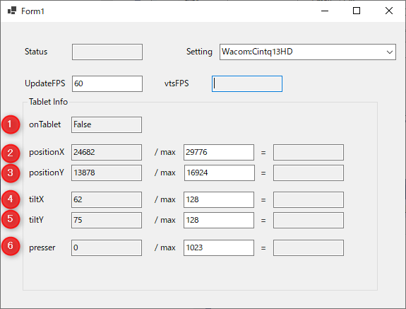

# VTS Pentab Plugin

[VTubeStudio](https://store.steampowered.com/app/1325860/VTube_Studio/?l=japanese)で動作する  
ペンの筆圧、傾き、位置の情報をCustomParameterとしてVTubeStudioに伝達するFormアプリケーションです。

# デモ

# 特徴

[Wacomが提供するWintab](http://wdnet.jp/library/windows/wintab#4.2)経由でペン情報を取得するとき、一般のペイントソフトでは問題なく情報取得ができます。  
しかし、配信アプリでペンの情報を取得する場合はWintabのフォーカスの取り合いが発生してペイントソフトの挙動に影響がでます。  
このプロジェクトではUSBで接続されるタブレットの信号情報を直接解析してWintabに鑑賞せずに情報を取得します。  
このために直接ペン情報を取り扱っているUSBデバイスを特定する必要があります。

# デバイスの特定

デバイスを特定するためにVenderId,HIDUsage,HIDUsagePageを特定する必要があります。  
通常のWintabに使用するデバイスと別のHIDデバイスにアクセスする必要がありました。  
他の環境を保有していないために現在の設定が他のデバイスで有効に動作するかは不明です。  
もし挙動が異なる場合、有効なデバイスの特定から総当りで行う必要があります。

VenderIdだけはUSBの[VenderIdList](https://www.usb.org/getting-vendor-id)から確認することができます。

[USB Device Tree Viewer](https://www.uwe-sieber.de/usbtreeview_e.html#download)でも有効なデバイスを探す手がかりになります。

# 実行条件

Visual Studio 2019でビルドができます。

# 使い方

## VTubeStudio側の使い方

VTubeStudioを起動したあとにプラグインアプリを起動してください。  
起動したあとにVTubeStudio側に接続要請のダイアログがでるので許可をクリックしてください。

## Plugin側の使い方

1. 起動と同時にVTubeStudioに接続されます。  
VTubeStudio側で許可を出してください。
2. 起動したあとにペンを一番右端と下に移動させます。  
その後Presserの欄が上がらなくなるまでペンを押し付けてください。  
この動作は最大値のキャリブレーションになります。

1. タブレットがペンを認識しているかどうかの情報です。  
VTubeStudio側にはFalseが0、Trueが1で認識されます。
1. タブレット左を0とした0.01mm単位での情報が入ります  
Maxは手動で設定と入力で大きいほうが設定されます。  
VTubeStudio側には入力/Maxの0～1の値で認識されます。
1. タブレット上を0とした0.01mm単位での情報が入ります  
Maxは手動で設定と入力で大きいほうが設定されます。  
VTubeStudio側には入力/Maxの0～1の値で認識されます。
1. ペンの画面に対して横方向の傾きの情報です。  
64でちょうど垂直になる計算です。
1. ペンの画面に対して縦方向の傾きの情報です。  
64でちょうど垂直になる計算です。
1. ペンの筆圧の情報です。  
製品の解像度と一致しないことがあります。

# Author

[Ganeesya](https://twitter.com/Ganeesya)